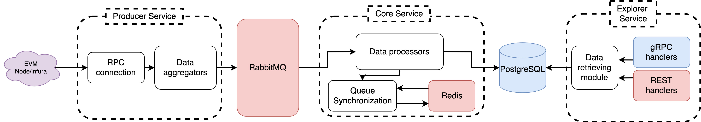

# Indexer – Modular EVM Blockchain Indexing System

**Indexer** is a cloud-native, modular indexing system for EVM-based blockchains, built for scalability, observability, and real-time access to on-chain data. It supports both REST and gRPC APIs and is fully deployable via Kubernetes.

---

## Overview

The system consists of the following microservices:

- **Core** — handles data indexing from the blockchain.
- **Producer** — parses on-chain data and publishes it to a message queue.
- **Explorer** — provides a public API for accessing indexed data.

> ⚠️ The Explorer service is still under development. Current features and status:
- [x] Basic block data API (REST)
- [ ] Advanced filtering
- [ ] Transaction explorer
- [ ] gRPC methods documentation
- [ ] Web UI (planned)

---

## Tech Stack

- **Languages:** Golang
- **Data Layer:** PostgreSQL, Redis
- **Messaging:** RabbitMQ
- **API Protocols:** gRPC, HTTP REST
- **Infrastructure:** Kubernetes
- **Monitoring:** Prometheus + Grafana *(Integration in progress – dashboards and alerts TBD)*

---

## Architecture



---

## Deployment

You can deploy the Indexer stack into a Kubernetes cluster using the following steps:

### 1. Connect to your Kubernetes cluster

```bash
export KUBECONFIG=<path-to-your-kubeconfig>
kubectl config use-context <your-cluster-name>
```

### 2. Set Required Secrets
```bash
kubectl create secret generic indexer-secrets \
  --from-literal=ETH_WS_NODE_RPC=wss://your-node-url \
  --from-literal=ETH_HTTP_NODE_RPC=https://your-node-url
```

### 3. Deploy All Resources
```bash
chmod +x ./k8s/deploy-all.sh
./k8s/deploy-all.sh
```

### 4. (Optional) Delete all Recources
```bash
chmod +x ./k8s/delete-all.sh
./k8s/delete-all.sh
```

This will create all necessary deployments, services, and initialize the system.

---

## Example Usage

### REST API (Explorer Service)

request:
```bash
curl http://<node_ip>:30083/api/v1/block/current
```

response:
```json
{
  "hash": "0x9f9814b21e5fe78920a7845ce39efb6f00314199b031a41ccf141d305e1b284b",
  "number": "8158069",
  "miner_hash": "0x3826539Cbd8d68DCF119e80B994557B4278CeC9f",
  "parent_hash": "0x5f0c8cb614ebdc02e3f804798ca9698fb95f196877a7cb2ceed92407b8204504",
  "gas_limit": 36000000,
  "gas_used": 14587549,
  "nonce": 0,
  "size": 59830,
  "difficulty": "0",
  "is_pos": false,
  "base_fee_per_gas": "424512137",
  "timestamp": 1745149044
}
```


